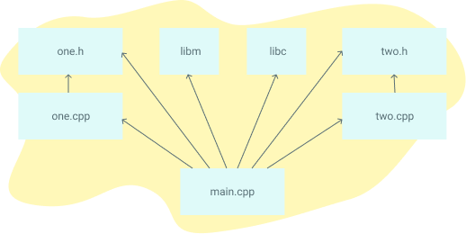

如果你对 Make 已经有一定了解，可以看看 [Makefile Cookbook](#makefile-cookbook)，里面有适合中型项目的模板，并对 Makefile 的每一部分都做了详细注释。

祝你好运，希望你能征服令人困惑的 Makefile 世界！

# 入门

## 为什么会有 Makefile？

Makefile 用于帮助决定大型程序的哪些部分需要重新编译。在绝大多数情况下，都是编译 C 或 C++ 文件。其他语言通常有自己的工具来实现类似 Make 的功能。Make 也可以用于编译之外的场景，比如根据文件的变化来运行一系列指令。本教程将聚焦于 C/C++ 的编译场景。

下面是你可能用 Make 构建的一个依赖关系图。如果某个文件的依赖发生变化，该文件就会被重新编译：



## Make 的替代品有哪些？

流行的 C/C++ 替代构建系统有 [SCons](https://scons.org/)、[CMake](https://cmake.org/)、[Bazel](https://bazel.build/) 和 [Ninja](https://ninja-build.org/)。一些代码编辑器如 [Microsoft Visual Studio](https://visualstudio.microsoft.com/) 也有内置的构建工具。Java 有 [Ant](https://ant.apache.org/)、[Maven](https://maven.apache.org/what-is-maven.html) 和 [Gradle](https://gradle.org/)。Go、Rust、TypeScript 等其他语言也有各自的构建工具。

像 Python、Ruby 和原生 Javascript 这样的解释型语言则不需要 Makefile 的类似物。Makefile 的目标是根据文件的变化编译需要编译的文件。但解释型语言的文件变化后无需重新编译，程序运行时会直接使用最新的文件。

## Make 的版本和类型

Make 有多种实现，但本指南的大部分内容适用于你正在使用的任何版本。不过，本文专为 GNU Make 编写，这是 Linux 和 MacOS 上的标准实现。所有示例适用于 Make 3 和 4 版本，二者除了少数细节外几乎等价。

## 运行示例

要运行这些示例，你需要一个终端并安装了 "make"。每个示例都放在名为 `Makefile` 的文件中，在该目录下运行 `make` 命令。让我们从最简单的 Makefile 开始：

```makefile
hello:
	echo "Hello, World"
```

> 注意：Makefile 必须用 TAB 缩进，不能用空格，否则 `make` 会报错。

运行上述示例的输出如下：

```shell
$ make
echo "Hello, World"
Hello, World
```

## Makefile 语法

一个 Makefile 由一组 规则 组成。规则（rule）通常如下所示：

```makefile
targets: prerequisites
	command
	command
```

- targets 是文件名，用空格分隔。通常每条规则只有一个目标。
- commands 是一系列用于生成目标的步骤。必须以 TAB 字符开头，不能用空格。
- prerequisites 也是文件名，用空格分隔。这些文件在执行目标命令前必须存在，也叫依赖。

## Make 的本质

让我们从一个 hello world 示例开始：

```makefile
hello:
	echo "Hello, World"
	echo "This line will print if the file hello does not exist."
```

这里已经有不少内容了。让我们拆解一下：

- 有一个名为 `hello` 的 目标
- 该目标有两条命令
- 该目标没有依赖

然后我们运行 `make hello`。只要 `hello` 文件不存在，命令就会执行。如果 `hello` 存在，则不会执行任何命令。

需要注意的是，这里 `hello` 既是 目标 也是 文件，两者是直接关联的。通常，目标被执行时（即目标的命令被执行时），这些命令会生成与目标同名的文件。但在本例中，`hello` 目标 并不会生成 `hello` 文件。

让我们创建一个更典型的 Makefile —— 编译一个 C 文件。在此之前，先创建一个名为 `blah.c` 的文件，内容如下：

```c
// blah.c
int main() { return 0; }
```

然后创建 Makefile（文件名仍为 `Makefile`）：

```makefile
blah:
	cc blah.c -o blah
```

这次，直接运行 `make`。由于没有为 `make` 命令指定目标，会执行第一个目标。本例中只有一个目标（`blah`）。第一次运行时会生成 `blah` 文件。第二次运行时会看到 `make: 'blah' is up to date`，因为 `blah` 文件已存在。但有个问题：如果我们修改了 `blah.c` 再运行 `make`，却不会重新编译。

我们通过添加依赖来解决这个问题：

```makefile
blah: blah.c
	cc blah.c -o blah
```

再次运行 `make`，会发生如下步骤：

- 选择第一个目标，因为第一个目标是默认目标
- 该目标依赖于 `blah.c`
- Make 决定是否需要执行 `blah` 目标。只有在 `blah` 不存在，或 `blah.c` 比 `blah` 新时才会执行

最后这一步很关键，是 **make 的本质**。它的目的是判断 `blah` 的依赖自上次编译后是否发生了变化。也就是说，如果 `blah.c` 被修改，运行 `make` 应该重新编译。反之，如果 `blah.c` 没变，就不需要重新编译。

为此，make 使用文件系统的时间戳作为判断依据。文件时间戳通常只在文件被修改时才会变化。但要注意，这并非总是准确。比如你可以修改文件后再把时间戳改回去，这样 make 就会误判文件没变，从而跳过编译。

内容有点多。**一定要理解这一点。这是 Makefile 的核心，可能需要几分钟仔细体会。** 多试试上面的例子，或者看上面的视频。

## 更多快速示例

下面这个 Makefile 最终会运行所有三个目标。在终端运行 `make` 时，会按如下步骤构建名为 `blah` 的程序：

- make 选择 `blah` 作为目标，因为第一个目标是默认目标
- `blah` 依赖于 `blah.o`，于是 make 查找 `blah.o` 目标
- `blah.o` 依赖于 `blah.c`，于是 make 查找 `blah.c` 目标
- `blah.c` 没有依赖，于是执行 `echo` 命令
- 所有 `blah.o` 的依赖完成后，执行 `cc -c` 命令
- 所有 `blah` 的依赖完成后，执行最上面的 `cc` 命令
- 完成：`blah` 是一个已编译的 C 程序

```makefile
blah: blah.o
	cc blah.o -o blah # 第三步执行

blah.o: blah.c
	cc -c blah.c -o blah.o # 第二步执行

blah.c:
	echo "int main() { return 0; }" > blah.c # 第一步执行
```

如果你删除 `blah.c`，三个目标都会重新执行。如果你编辑它（使时间戳比 `blah.o` 新），前两个目标会执行。如果你运行 `touch blah.o`（使时间戳比 `blah` 新），只有第一个目标会执行。如果什么都不变，所有目标都不会执行。可以试试看！

下一个例子总会执行两个目标，`some_file` 依赖于 `other_file`，而后者永远不会被创建。

```makefile
some_file: other_file
	echo "This will always run, and runs second"
	touch some_file

other_file:
	echo "This will always run, and runs first"
```

## Make clean

`clean` 通常用作删除其他目标输出的目标，你可以运行 `make` 和 `make clean` 来创建和删除 `some_file`。

注意 `clean` 的两点：

- 它不是第一个目标（默认目标），也不是依赖，因此只有显式调用 `make clean` 时才会执行
- 它不是用来生成文件的。如果你有个名为 `clean` 的文件，这个目标不会执行，这不是我们想要的。后文会介绍使用 `.PHONY` 的方法来解决这个问题(见其他特性一节中的.phony)

```makefile
some_file:
	touch some_file

clean:
	rm -f some_file
```

## 变量

变量只能是字符串。通常建议用 `:=`，但 `=` 也可以。详见变量 Pt. 2小节。

下面是变量用法示例：

```makefile
files := file1 file2
some_file: $(files)  #相当于some_file: file1 file2
	echo "Look at this variable: " $(files)
	touch some_file

file1:
	touch file1
file2:
	touch file2

clean:
	rm -f file1 file2 some_file
```

单引号或双引号对 Make 没有意义，它们只是普通字符而已。引号对 shell/bash 有用，比如在 `printf` 命令中。下面示例中，两个命令的行为相同：

```makefile
a := one two# a 被设为字符串 "one two"
b := 'one two' # 不推荐。b 被设为字符串 "'one two'"
all:
	printf '$a'
	printf $b
```

终端中 make 一下，是否和你的预期不符？a 变量是字符串one two，b 变量是字符串‘one two’，为什么终端打印了是one two，没有引号呢？实际上‘ ’是printf所需的，b 变量多了‘ ’，而这对引号和 printf 达成了组合。

用 `${}` 或 `$()` 来引用变量：

```makefile
x := dude

all:
	echo $(x)
	echo ${x}

	# 不好的做法，但能用
	echo $x
```

# 目标

## all 目标

想要构建多个目标并让它们全部执行？创建一个 `all` 目标。
由于这是第一个规则，如果直接运行 `make` 而不指定目标，会默认执行这个规则。

```makefile
all: one two three

one:
	touch one
two:
	touch two
three:
	touch three

clean:
	rm -f one two three
```

## 多目标

当一个规则有多个目标时，会拆分目标分别执行。`$@` 是一个自动变量，代表目标对象

```makefile
all: f1.o f2.o

f1.o f2.o:
	echo $@
# 等价于：
# f1.o:
# 	echo f1.o
# f2.o:
# 	echo f2.o
```

# 自动变量和通配符

## * 通配符

`*` 和 `%` 在 Make 中都被称为通配符，但意义完全不同。`*` 在文件系统中搜索匹配的文件名，我建议总是将其包装在 `wildcard` 函数中。

在 GNU Make 中，`wildcard` 是一个函数 ，它的作用是：从文件系统中查找匹配某个模式的文件名 ，并在 makefile 解析阶段 展开成一串文件名字符串，假设当前目录下有文件：main.c util.c lib.c Makefile，$(wildcard *.c) 会被展开为 main.c util.c lib.c。

为什么不直接写 `*.c` ？

> 因为 `*.c` 在 Makefile 中的行为 依上下文而异 ：
>
> * 在  规则头部 （target/prerequisites 里），在prerequisites位置时，`*.c` 通常不会按预期工作，在 target 位置时，`*.c`可能会被展开，但行为不可预测
> * 在  命令行命令中 ，`*.c` 可能被 shell 展开，但并不总是安全或可靠；
> * 在  变量定义中 ，`*.c` 不会自动展开为文件名。
>
> 所以使用 `$(wildcard *.c)` 是一种  安全且明确的写法 ，可以跨平台、跨工具稳定工作。

注意：`*` 不能直接用在变量定义中

注意：当 `*` 不匹配任何文件时，它保持原样（除非在 `wildcard` 函数中运行）

```makefile
thing_wrong := *.o # 不要这样做！'*' 不会被扩展
thing_right := $(wildcard *.o)

all: one two three four

# fail，因为 $(thing_wrong) 是字符串 "*.o"
one: $(thing_wrong)

# 如果没有匹配此模式的文件，保持为 *.o 
two: *.o

# 这样写可以按照我们的预期工作了！虽然在该例子中什么command也没执行
three: $(thing_right)

# 与规则三相同
four: $(wildcard *.o)
```

## % 通配符

`%` 非常有用，但可能令人困惑，因为它可以在多种情况下使用。

- 在"匹配"模式中，它匹配字符串中的一个或多个字符。这个匹配称为词干（stem）。
- 在"替换"模式中，它获取匹配的词干并在字符串中替换。
- `%` 最常用在规则定义和某些特定函数中。

## 来看看 % 和 * 的区别吧

为防止自己的理解有误，我用gpt 生成了下面内容

`*`：匹配 真实文件名

用途：用于匹配文件系统上的文件名，比如所有 `.c` 文件、所有以 `test_` 开头的文件。

使用场景：`SRC := $(wildcard *.c)`

这里 `*` 是 shell 中的文件匹配符，和 Bash 里的通配是一样的，它用在像 `wildcard` 这样的函数中或命令中，如果直接在规则里写 `*.c`，容易出错。

`%`：匹配规则中的 模式部分

用途：`%` 用在 规则（rule） 里，用来描述多个文件之间的 构建关系 ，而不是查找文件

```makefile
%.o: %.c
	$(CC) -c $< -o $@ #看不懂这条命令可以先忽略，可以简单理解为 gcc -c xxx.c -o xxx.o

```

这意味着：

* 任意以 `.c` 结尾的文件都可以构建出对应的 `.o` 文件；
* 如果 `foo.c` 存在，那么可以通过这条规则自动推导出如何生成 `foo.o`。

这里 `%` 匹配的是 “`foo`” 这个部分，称为 stem 。

## 自动变量

有许多[自动变量](https://www.gnu.org/software/make/manual/html_node/Automatic-Variables.html)，但经常只会用到少数几个：

```makefile
hey: one two
	# 输出 "hey"，$@ 代表目标文件
	echo $@

	# 输出所有比目标新的依赖， $? 代表依赖中比目标新的那些文件
	echo $?

	# 输出所有依赖，$^ 代表依赖列表中的所有文件
	echo $^

	# 输出第一个依赖，$< 代表依赖列表中的第一个文件
	echo $<

	touch hey

one:
	touch one

two:
	touch two

clean:
	rm -f hey one two
```

# 高级规则

## 隐含规则

Make 很喜欢 C 编译。每次表达这种喜爱时，事情就会变得令人困惑。也许 Make 最令人困惑的部分是所谓的魔法/自动规则。Make 称这些为"隐含"规则。我个人不认同这种设计决定，也不建议使用，但它们经常被用到，所以了解很有用。以下是隐含规则列表：

- 编译 C 程序：`n.o` 会自动从 `n.c` 生成，命令形式为 `$(CC) -c $(CPPFLAGS) $(CFLAGS) $^ -o $@`
- 编译 C++ 程序：`n.o` 会自动从 `n.cc` 或 `n.cpp` 生成，命令形式为 `$(CXX) -c $(CPPFLAGS) $(CXXFLAGS) $^ -o $@`
- 链接单个目标文件：`n` 会自动从 `n.o` 生成，运行命令 `$(CC) $(LDFLAGS) $^ $(LOADLIBES) $(LDLIBS) -o $@`

隐含规则使用的重要变量：

- `CC`：编译 C 程序的程序；默认 `gcc`
- `CXX`：编译 C++ 程序的程序；默认 `g++`
- `CPPFLAGS`：给 C 预处理器的额外标志
- `CFLAGS`：给 C 编译器的额外标志
- `CXXFLAGS`：给 C++ 编译器的额外标志
- `LDFLAGS`：编译器调用链接器时的额外标志

让我们看看如何在不明确告诉 Make 如何编译的情况下构建 C 程序：

```makefile
CC = gcc # 隐含规则的标志
CFLAGS = -g # 隐含规则的标志。开启调试信息

# 隐含规则 1：blah 通过 C 链接器隐含规则构建
# 隐含规则 2：blah.o 通过 C 编译隐含规则构建，因为 blah.c 存在
blah: blah.o

blah.c:
	echo "int main() { return 0; }" > blah.c 

clean:
	rm -f blah*
```

## 静态模式规则

静态模式规则是在 Makefile 中减少代码的另一种方法。语法如下：

```makefile
targets...: target-pattern: prereq-patterns ...
   commands
```

要点是给定的 `target` 通过 `target-pattern`（通过 `%` 通配符）匹配。匹配的内容称为词干。然后词干替换到 `prereq-pattern` 中，生成目标的依赖。

典型用例是将 `.c` 文件编译为 `.o` 文件。这是 手动方式：

```makefile
objects = foo.o bar.o all.o
all: $(objects)
	$(CC) $^ -o all

foo.o: foo.c
	$(CC) -c foo.c -o foo.o

bar.o: bar.c
	$(CC) -c bar.c -o bar.o

all.o: all.c
	$(CC) -c all.c -o all.o

all.c:
	echo "int main() { return 0; }" > all.c

# 注意：all.c 不使用此规则，因为当有多个匹配时，Make 优先选择更具体的匹配。
%.c:
	touch $@

clean:
	rm -f *.c *.o all
```

这是更高效的方式，使用静态模式规则：

```makefile
objects = foo.o bar.o all.o
all: $(objects)
	$(CC) $^ -o all

# 语法 - targets ...: target-pattern: prereq-patterns ...
# 对于第一个目标 foo.o，target-pattern 匹配 foo.o 并将"词干"设为 "foo"。
# 然后用该词干替换 prereq-patterns 中的 '%'
$(objects): %.o: %.c
	$(CC) -c $^ -o $@

all.c:
	echo "int main() { return 0; }" > all.c

# 注意：all.c 不使用此规则，因为当有多个匹配时，Make 优先选择更具体的匹配。
%.c:
	touch $@

clean:
	rm -f *.c *.o all
```

## 静态模式规则和过滤器

虽然我在后面才会介绍filter 函数，但它常用于静态模式规则，所以这里提一下。

`filter` 函数可用于静态模式规则中匹配正确的文件。在此示例中，我创造了 `.raw` 和 `.result` 扩展名。

```makefile
obj_files = foo.result bar.o lose.o
src_files = foo.raw bar.c lose.c

all: $(obj_files)
# 注意：PHONY 在这里很重要。没有它，隐含规则会尝试构建可执行文件 "all"，因为依赖是 ".o" 文件
# .PHONY的介绍在‘其他特性’这一小节中
.PHONY: all

# 例 1：.o 文件依赖 .c 文件
$(filter %.o,$(obj_files)): %.o: %.c
	echo "target: $@ prereq: $<"

# 例 2：.result 文件依赖 .raw 文件
$(filter %.result,$(obj_files)): %.result: %.raw
	echo "target: $@ prereq: $<"

%.c %.raw:
	touch $@

clean:
	rm -f $(src_files)
```

## 模式规则

模式规则经常被使用但相当令人困惑。你可以从两个角度看它们：

- 定义自己的隐含规则的方法
- 静态模式规则的简化形式

让我们先从示例开始：

```makefile
# 定义一个模式规则，将每个 .c 文件编译为 .o 文件
%.o : %.c
        $(CC) -c $(CFLAGS) $(CPPFLAGS) $< -o $@
```

模式规则的目标中包含 '%'。这个 '%' 匹配任何非空字符串，其他字符匹配自身。依赖中的 '%' 代表目标中 '%' 匹配的相同词干。

## 双冒号规则

双冒号规则很少使用，但这使得  为同一目标定义多个规则  成为可能。如果这些::是单冒号，会打印警告，只有第二组命令会运行。

```makefile
all: blah

blah::
	echo "hello"

blah::
	echo "hello again"
```

# 命令和执行

## 命令回显/静默

在命令前添加 `@` 来阻止其被打印
你也可以运行 `make -s` 在每行前添加 `@`

简而言之就是不要执行的每条命令都在终端中被打印出来，只需要安静地执行即可

```makefile
all:
	@echo "This make line will not be printed"
	echo "But this will"
```

## 命令执行

每个命令都在新的 shell 中运行（或至少效果如此）

```makefile
all:
	cd ..
	# 上面的 cd 不会影响这一行，因为每个命令实际上都在新的 shell 中运行
	echo `pwd`

	# 这个 cd 命令影响下一个，因为它们在同一行
	cd ..;echo `pwd`

	# 与上面相同
	cd ..; \
	echo `pwd`
```

## 默认 Shell

默认 shell 是 `/bin/sh`。你可以通过改变变量 SHELL 来改变它：

```makefile
SHELL=/bin/bash

cool:
	echo "Hello from bash"
```

## 双美元符号

如果你想要字符串中有美元符号，可以使用 `$$`。这是在 `bash` 或 `sh` 中使用 shell 变量的方法。

Shell 是一个通用概念，指的是命令行解释器（Command Line Interpreter）。它是用户与操作系统内核交互的接口。bash （Bourne Again Shell）是 Shell 的一种具体实现，是最常用的 Shell 之一。

**常见的 Shell 类型：**

* sh - 原始的 Bourne Shell（或兼容版本）
* bash - Bash Shell（最流行）
* zsh - Z Shell（macOS 默认）
* `/bin/fish` - Fish Shell
* csh - C Shell

注意下一个示例中 Makefile 变量和 Shell 变量的区别。

```makefile
make_var = I am a make variable
all:
	# 与在 shell 中运行 "sh_var='I am a shell variable'; echo $sh_var" 相同
	sh_var='I am a shell variable'; echo $$sh_var

	# 与在 shell 中运行 "echo I am a make variable" 相同
	echo $(make_var)
```

译者解释一下吧，第一个命令：`sh_var='I am a shell variable'; echo $$sh_var`

`sh_var='I am a shell variable'` - 在 shell 中创建一个 shell 变量（不是 Makefile 变量）

后面为什么要用 `$$`？ 在 Makefile 中，`$` 是特殊字符，用于引用 Makefile 变量，如果你写 `$sh_var`，Make 会认为你要引用一个名为 `sh_var` 的 Makefile 变量，而 `$$` 会被 Make 转义成一个单独的 `$`，然后传递给 shell所以 shell 实际收到的命令是：`sh_var='I am a shell variable'; echo $sh_var`。

第二个命令：`echo $(make_var)`

`$(make_var)` - 这是引用 Makefile 变量的语法，Make 会在执行前将 `$(make_var)` 替换为 `I am a make variable`，所以 shell 实际收到的命令是：`echo I am a make variable`。

## 用 `-k`、`-i` 和 `-` 处理错误

运行 make 时添加 `-k` 即使遇到错误也继续运行。如果你想一次看到 Make 的所有错误很有用。
在命令前添加 `-` 来抑制错误
添加 `-i` 让 make 对每个命令都这样做。

```makefile
one:
	# 此错误会被打印但忽略，make 会继续运行
	-false
	touch one
```

## 递归使用 make

要递归调用 makefile，使用特殊的 `$(MAKE)` 而不是 `make`，因为它会为你传递 make 标志，并且本身不会受到它们的影响。

```makefile
new_contents = "hello:\n\ttouch inside_file"
all:
	mkdir -p subdir
	printf $(new_contents) | sed -e 's/^ //' > subdir/makefile #看不懂的话问问大模型吧，再在终端中实操一下
	cd subdir && $(MAKE)

clean:
	rm -rf subdir
```

## 导出、环境变量和递归 make

当 Make 启动时，它会自动从执行时设置的所有环境变量创建 Make 变量。

```makefile
# 用 "export shell_env_var='I am an environment variable'; make" 运行
all:
	# 打印 Shell 变量
	echo $$shell_env_var

	# 打印 Make 变量
	echo $(shell_env_var)
```

`export` 指令获取一个变量并为所有配方中的所有 shell 命令设置环境：

```makefile
shell_env_var=Shell env var, created inside of Make
export shell_env_var
all:
	echo $(shell_env_var)
	echo $$shell_env_var
```

因此，当你在 make 内运行 `make` 命令时，可以使用 `export` 指令让 sub-make 命令可以访问它。在此示例中，`cooly` 被导出，以便 subdir 中的 makefile 可以使用它。

```makefile
new_contents = "hello:\n\techo \$$(cooly)"

all:
	mkdir -p subdir
	printf $(new_contents) | sed -e 's/^ //' > subdir/makefile
	@echo "---MAKEFILE CONTENTS---"
	@cd subdir && cat makefile
	@echo "---END MAKEFILE CONTENTS---"
	cd subdir && $(MAKE)

# 注意变量和导出。它们是全局设置/影响的。
cooly = "The subdirectory can see me!"
export cooly
# 这会取消上面的行：unexport cooly

clean:
	rm -rf subdir
```

你需要导出变量才能在 shell 中运行它们。

```makefile
one=this will only work locally
export two=we can run subcommands with this

all:
	@echo $(one)
	@echo $$one
	@echo $(two)
	@echo $$two

# 终端会输出：
this will only work locally

we can run subcommands with this
we can run subcommands with this
```

`.EXPORT_ALL_VARIABLES` 为你导出所有变量。

```makefile
.EXPORT_ALL_VARIABLES:
new_contents = "hello:\n\techo \$$(cooly)"

cooly = "The subdirectory can see me!"
# 这会取消上面的行：unexport cooly

all:
	mkdir -p subdir
	printf $(new_contents) | sed -e 's/^ //' > subdir/makefile
	@echo "---MAKEFILE CONTENTS---"
	@cd subdir && cat makefile
	@echo "---END MAKEFILE CONTENTS---"
	cd subdir && $(MAKE)

clean:
	rm -rf subdir
```

## make 的参数

有一个很好的[选项列表](http://www.gnu.org/software/make/manual/make.html#Options-Summary)可以从 make 运行。自己看看 `--dry-run`、`--touch`、`--old-file` 吧。（不看也行，用到再看也无妨）

你可以有多个目标来 make，即 `make clean run test` 运行 `clean` 目标，然后 `run`，然后 `test`。

# 变量 Pt. 2

## 类型和修改（= / :=）

有两种类型的变量：

- 递归（使用 `=`） 只在命令 使用 时查找变量，而不是在 定义 时。
- 简单扩展（使用 `:=`） 像正常的命令式编程 —— 只有到目前为止定义的那些会被扩展

  简而言之，用=赋值的 one，会在 echo 时才查找later_variable的值，即使later_variable的声明在 one 之后；而 two 只是简单拓展，它在定义时立刻进行拓展，此时later_variable还没定义呢，所以two 变量只是 two

```makefile
# 递归变量。下面会打印 "later"
one = one ${later_variable}
# 简单扩展变量。下面不会打印 "later"
two := two ${later_variable}

later_variable = later

all:
	echo $(one)
	echo $(two)
```

简单扩展（使用 `:=`）允许你追加到变量。如果是递归定义（=）则会给出无限循环错误。

```makefile
one = hello
# one 被定义为简单扩展变量（:=），因此可以处理追加
one := ${one} there

all:
	echo $(one)
```

`?=` 只在变量尚未设置时设置变量

```makefile
one = hello
one ?= will not be set
two ?= will be set

all:
	echo $(one)
	echo $(two)
```

行尾的空格不会被去除，但开头的会。要创建只有一个空格的变量，使用 `$(nullstring)`

```makefile
with_spaces = hello   # with_spaces 在 "hello" 后有很多空格
after = $(with_spaces)there

nullstring =
space = $(nullstring) # 创建一个只有单个空格的变量。

all:
	echo "$(after)"
	echo start"$(space)"end
```

未定义的变量实际上是空字符串！

```makefile
all:
	# 未定义的变量只是空字符串！
	echo $(nowhere)
```

使用 `+=` 来追加

```makefile
foo := start
foo += more

all:
	echo $(foo)
```

后文中的字符串替换也是修改变量的一种常见和有用的方法。还可以查看[文本函数](https://www.gnu.org/software/make/manual/html_node/Text-Functions.html#Text-Functions)和[文件名函数](https://www.gnu.org/software/make/manual/html_node/File-Name-Functions.html#File-Name-Functions)。

## 命令行参数和覆盖

你可以使用 `override` 覆盖来自命令行的变量
这里我们用 `make option_one=hi` 运行 make

```makefile
# 覆盖命令行参数
override option_one = did_override
# 不覆盖命令行参数
option_two = not_override
all:
	echo $(option_one)
	echo $(option_two)
```

## 命令列表和 define

[define 指令](https://www.gnu.org/software/make/manual/html_node/Multi_002dLine.html)不是函数，尽管它可能看起来像。我很少看到它被使用，所以不会详细介绍，但它主要用于定义[canned recipes ](https://www.gnu.org/software/make/manual/html_node/Canned-Recipes.html#Canned-Recipes)，也与 [eval 函数](https://www.gnu.org/software/make/manual/html_node/Eval-Function.html#Eval-Function)很好地配对。

`define`/`endef` 创建一个命令列表的变量。注意这里与在命令之间使用分号有点不同，因为列表中的每行命令都在单独的 shell 中运行

```makefile
one = export blah="I was set!"; echo $$blah

define two
export blah="I was set!" #export 并没有什么用，下一行 echo 依然重开一个 shell 运行
echo $$blah
endef

all:
	@echo "This prints 'I was set'"
	@$(one)
	@echo "This does not print 'I was set' because each command runs in a separate shell"
	@$(two)
```

## 目标特定变量

可以为特定目标设置变量  Target-specific variables，该变量仅在这个目标中有效

```makefile
all: one = cool  #在目标 all 中，one 的值为 cool，在 other 中 one 没有定义

all:
	echo one is defined: $(one)

other:
	echo one is nothing: $(one)
```

## 模式特定变量

你可以为特定模式的目标设置变量   Pattern-specific variables，该变量仅在该模式能匹配到的目标中有效

```makefile
%.c: one = cool

blah.c:
	echo one is defined: $(one) #.c文件为目标时，one 有定义

other:
	echo one is nothing: $(one)
```

# Makefile 的条件部分

## 条件 if/else

```makefile
foo = ok

all:
ifeq ($(foo), ok)
	echo "foo equals ok"
else
	echo "nope"
endif
```

## 检查变量是否为空

```makefile
nullstring =
foo = $(nullstring) # end of line; there is a space here

all:
ifeq ($(strip $(foo)),)
	echo "foo is empty after being stripped"
endif
ifeq ($(nullstring),)
	echo "nullstring doesn't even have spaces"
endif
```

## 检查变量是否已定义

ifdef 不扩展变量引用；它只是看是否定义了任何东西

```makefile
bar =
foo = $(bar)

all:
ifdef foo
	echo "foo is defined"
endif
ifndef bar
	echo "but bar is not"
endif
```

## $(MAKEFLAGS)

此示例显示如何使用 `findstring` 和 `MAKEFLAGS` 测试 make 标志。用 `make -i` 运行此示例以查看它打印 echo 语句。

```makefile
all:
# 搜索 "-i" 标志。MAKEFLAGS 只是单个字符的列表，每个标志一个。所以在这种情况下查找 "i"。
ifneq (,$(findstring i, $(MAKEFLAGS)))
	echo "i was passed to MAKEFLAGS"
endif
```

# 函数

## 第一个函数

函数 主要用于文本处理。用 `$(fn, arguments)` 或 `${fn, arguments}` 调用函数。Make 有相当数量的[内置函数](https://www.gnu.org/software/make/manual/html_node/Functions.html)。

```makefile
bar := ${subst not,"totally", "I am not superman"} #在最后一个参数中，将 not 替换为 totally，echo 的结果是I am totally superman
all:
	@echo $(bar)
```

如果你想替换空格或逗号，使用变量

```makefile
comma := ,
empty:=
space := $(empty) $(empty)
foo := a b c
bar := $(subst $(space),$(comma),$(foo)) #把 foo 中的空格替换为,了

all:
	@echo $(bar)
```

不要在第一个参数后包含空格。那会被视为字符串的一部分。

```makefile
comma := ,
empty:=
space := $(empty) $(empty)
foo := a b c
bar := $(subst $(space), $(comma) , $(foo)) # 注意！

all:
	# 输出是 ", a , b , c"。注意引入的空格
	@echo $(bar)
```

## 字符串替换

`$(patsubst pattern,replacement,text)` 执行以下操作：（担心自己的表述不清，就放原文了，实际上直接看代码也能看懂）

"Finds whitespace-separated words in text that match pattern and replaces them with replacement. Here pattern may contain a ‘%’ which acts as a wildcard, matching any number of any characters within a word. If replacement also contains a ‘%’, the ‘%’ is replaced by the text that matched the ‘%’ in pattern. Only the first ‘%’ in the pattern and replacement is treated this way; any subsequent ‘%’ is unchanged."

 `$(text:pattern=replacement)` 是其简写。

还有另一个简写：`$(text:suffix=replacement)`，这里不使用 `%` 通配符。

注意：不要为此简写添加额外的空格。它会被视为搜索或替换术语。

```makefile
foo := a.o b.o l.a c.o
one := $(patsubst %.o,%.c,$(foo))
# 这是上面的简写
two := $(foo:%.o=%.c)
# 这是仅后缀简写，也等同于上面。
three := $(foo:.o=.c)

all:
	echo $(one)
	echo $(two)
	echo $(three)
```

## foreach 函数

foreach 函数看起来像这样：`$(foreach var,list,text)`。它将一个list（用空格分隔）转换为另一个list。var 设置为列表中的每个词，text 为每个单词扩展。
例如下面会在每个单词后附加一个感叹号：

```makefile
foo := who are you
# 对于 foo 中的每个"单词"，输出带有感叹号的相同单词
bar := $(foreach wrd,$(foo),$(wrd)!)

all:
	# 输出是 "who! are! you!"
	@echo $(bar)
```

## if 函数

`if` 检查第一个参数是否非空。如果是，运行第二个参数，否则运行第三个。

```makefile
foo := $(if this-is-not-empty,then!,else!)
empty :=
bar := $(if $(empty),then!,else!)

all:
	@echo $(foo) # then！
	@echo $(bar) # else！
```

## call 函数

Make 支持创建基本函数。你通过创建变量来"定义"函数，但使用参数 `$(0)`、`$(1)` 等。然后用特殊的 [`call`](https://www.gnu.org/software/make/manual/html_node/Call-Function.html#Call-Function) 内置函数调用该函数。语法是 `$(call variable,param,param)`。`$(0)` 是变量名，而 `$(1)`、`$(2)` 等是参数。

```makefile
sweet_new_fn = Variable Name: $(0) First: $(1) Second: $(2) Empty Variable: $(3)

all:
	# 输出 "Variable Name: sweet_new_fn First: go Second: tigers Empty Variable:"
	@echo $(call sweet_new_fn, go, tigers)
```

## shell 函数

shell - 这调用 shell，但它用空格替换换行符！

```makefile
all:
	@echo $(shell ls -la) # 非常难看，因为换行符消失了！
```

## filter 函数

`filter` 函数用于从列表中选择匹配特定模式的某些元素。例如，这将从 `obj_files` 中选择所有以 `.o` 结尾的元素。

```makefile
obj_files = foo.result bar.o lose.o
filtered_files = $(filter %.o,$(obj_files))

all:
	@echo $(filtered_files)
```

Filter 也可以用于更复杂的方式：

1. **过滤多个模式**：你可以一次过滤多个模式。例如，`$(filter %.c %.h, $(files))` 将从文件列表中选择所有 `.c` 和 `.h` 文件。
2. **否定**：如果你想选择所有不匹配模式的元素，可以使用 `filter-out`。例如，`$(filter-out %.h, $(files))` 将选择所有不是 `.h` 文件的文件。
3. **嵌套过滤器**：你可以嵌套过滤器函数来应用多个过滤器。例如，`$(filter %.o, $(filter-out test%, $(objects)))` 将选择所有以 `.o` 结尾但不以 `test` 开头的对象文件。

# 其他特性

## 包含 Makefile

include 指令告诉 make 读取一个或多个其他 makefile。它是 makefile 中的一行，看起来像这样：

```makefile
include filenames...
```

当你使用像 `-M` 这样的编译器标志创建基于源代码的 Makefile 时，这特别有用。例如，如果某些 c 文件包含头文件，该头文件将被添加到 gcc 编写的 Makefile 中。我在 [Makefile Cookbook](#makefile-cookbook) 中更多地讨论了这个。

## vpath 指令

使用 vpath 指定某些依赖存在的位置。格式是 `vpath <pattern> <directories, space/colon separated>`
`<pattern>` 可以有 `%`，它匹配任何零个或多个字符。
你也可以用变量 VPATH 全局地做这件事

```makefile
vpath %.h ../headers ../other-directory

# 注意：vpath 允许找到 blah.h，即使 blah.h 从不在当前目录中
some_binary: ../headers blah.h
	touch some_binary

../headers:
	mkdir ../headers

# 我们调用目标 blah.h 而不是 ../headers/blah.h，因为这是 some_binary 正在寻找的依赖
# 通常blah.h 已经存在，你不需要这个。
blah.h:
	touch ../headers/blah.h

clean:
	rm -rf ../headers
	rm -f some_binary
```

## 多行

反斜杠（"\\"）字符让我们能够在命令太长时使用多行

```makefile
some_file:
	echo This line is too long, so \
		it is broken up into multiple lines
```

## .phony

`.PHONY` 是 Make 的一个特殊目标，用来声明"伪目标"（phony targets）。它的主要作用是：

**防止文件名冲突**
当你的目标名称与某个存在的文件名相同时，make 会认为目标已是最新，不会执行命令
比如

```makefile
clean:
    rm -f *.o
```

如果当前目录下有名为 clean 的文件，make clean 时，Make 会检查 clean 文件，发现它存在且没有依赖，就好认为目标已经完成，不会执行 rm 的命令

**明确意图**

明确表示这些目标是用来执行操作的，而不是用来生成文件的。常见的伪目标有：

* `clean` - 清理编译产生的文件
* `install` - 安装程序
* `test` - 运行测试
* `all` - 构建所有目标
* `help` - 显示帮助信息

完整示例

```makefile
.PHONY: all clean install test

all: program

program: main.o utils.o
    gcc $^ -o $@

main.o: main.c
    gcc -c main.c

utils.o: utils.c
    gcc -c utils.c

clean:
    rm -f *.o program

install: program
    cp program /usr/local/bin/

test: program
    ./program --test
```

## .delete_on_error

如果命令返回非零退出状态，make 工具将停止运行命令（并将传播回依赖）。DELETE_ON_ERROR将会删除这个规则（rule）产生的目标（target)

```makefile
.DELETE_ON_ERROR:
all: one two

one:
	touch one
	true # 这个规则产生的 one 不会被删除
two:
	touch two
	false # 返回了非零退出状态，产生的 two 会被删除
```

# Makefile Cookbook

让我们来看一个非常棒的 Make 示例，它很适合中型项目。（入门往往用不上下面的模版）

这个 makefile 的巧妙之处在于它自动为你确定依赖关系。你所要做的就是将 C/C++ 文件放在 `src/` 文件夹中。

```makefile
# 感谢 Job Vranish (https://spin.atomicobject.com/2016/08/26/makefile-c-projects/)
TARGET_EXEC := final_program

BUILD_DIR := ./build
SRC_DIRS := ./src

# 查找我们想要编译的所有 C 和 C++ 文件
# 注意 * 表达式周围的单引号。shell 会错误地扩展这些，但我们想要将 * 直接发送到 find 命令。
SRCS := $(shell find $(SRC_DIRS) -name '*.cpp' -or -name '*.c' -or -name '*.s')

# 为每个 src 文件前加 BUILD_DIR 并后加 .o
# 例如，./your_dir/hello.cpp 变成 ./build/./your_dir/hello.cpp.o
OBJS := $(SRCS:%=$(BUILD_DIR)/%.o)

# 字符串替换（不带 % 的后缀版本）。
# 例如，./build/hello.cpp.o 变成 ./build/hello.cpp.d
DEPS := $(OBJS:.o=.d)

# ./src 中的每个文件夹都需要传递给 GCC，以便它可以找到头文件
INC_DIRS := $(shell find $(SRC_DIRS) -type d)
# 为 INC_DIRS 添加前缀。所以 moduleA 会变成 -ImoduleA。GCC 理解这个 -I 标志
INC_FLAGS := $(addprefix -I,$(INC_DIRS))

# -MMD 和 -MP 标志一起为我们生成 Makefile！
# 这些文件的输出将是 .d 而不是 .o。
CPPFLAGS := $(INC_FLAGS) -MMD -MP

# 最终构建步骤。
$(BUILD_DIR)/$(TARGET_EXEC): $(OBJS)
	$(CXX) $(OBJS) -o $@ $(LDFLAGS)

# C 源码的构建步骤
$(BUILD_DIR)/%.c.o: %.c
	mkdir -p $(dir $@)
	$(CC) $(CPPFLAGS) $(CFLAGS) -c $< -o $@

# C++ 源码的构建步骤
$(BUILD_DIR)/%.cpp.o: %.cpp
	mkdir -p $(dir $@)
	$(CXX) $(CPPFLAGS) $(CXXFLAGS) -c $< -o $@

.PHONY: clean
clean:
	rm -r $(BUILD_DIR)

# 包含 .d makefile。前面的 - 抑制缺少 Makefile 的错误。
# 最初，所有 .d 文件都会缺失，我们不希望这些错误显示出来。
-include $(DEPS)
```
